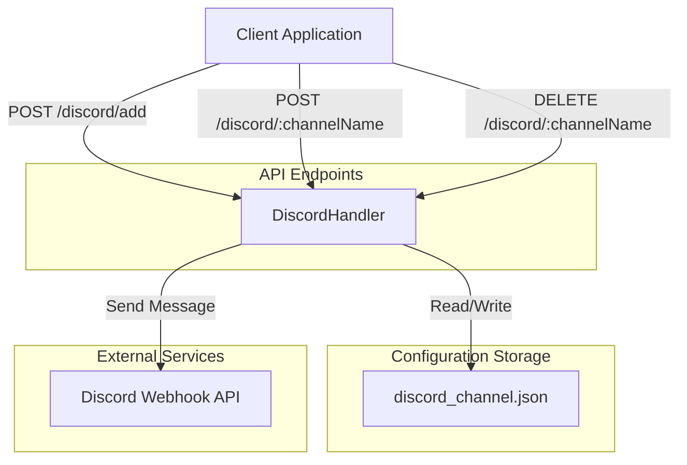

# goNotify

> [!NOTE]
> This README was generated by Claude Code, get the ZH version from [here](./README.zh.md).

[](https://pkg.go.dev/goNotify)
[](LICENSE)
[](https://goreportcard.com/report/github.com/pardnchiu/bot)

> A lightweight Go notification API service providing Discord Webhook integration with dynamic channel registration, message sending, and channel management capabilities.

## Features

- **RESTful API Design**: Clean HTTP API interface for easy integration with any application
- **Discord Webhook Integration**: Full support for Discord Embed message format including images, fields, footers, and more
- **Dynamic Channel Management**: Add or remove Discord channel configurations via API without service restart
- **JSON Configuration Storage**: File-based persistence for channel configurations with simple data management
- **Concurrency-Safe Design**: RWMutex protection for shared resources ensuring data consistency in multi-threaded environments
- **Input Validation**: Regex validation for channel names and Webhook URLs to enhance system security

## Architecture Flow



## Installation

### Prerequisites

- Go 1.25.1 or later
- Valid Discord Webhook URL

### Download and Build

```bash
# Clone the project
git clone https://github.com/pardnchiu/bot.git
cd bot

# Install dependencies
go mod download

# Build the project
go build -o goNotify ./cmd/api

# Run the service
./goNotify
```

The service will start at `http://localhost:8080`.

## Usage

### 1. Add Discord Channel

Before sending notifications, register a Discord Webhook URL:

```bash
curl -X POST http://localhost:8080/discord/add \
  -H "Content-Type: application/json" \
  -d '{
    "datas": [
      {
        "name": "alerts",
        "webhook": "https://discord.com/api/webhooks/1234567890/abcdefghijklmnopqrstuvwxyz"
      },
      {
        "name": "logs",
        "webhook": "https://discord.com/api/webhooks/0987654321/zyxwvutsrqponmlkjihgfedcba"
      }
    ]
  }'
```

**Response:**
```json
{
  "message": "channels added successfully"
}
```

### 2. Send Basic Notification

```bash
curl -X POST http://localhost:8080/discord/alerts \
  -H "Content-Type: application/json" \
  -d '{
    "title": "System Alert",
    "description": "Server CPU usage exceeded 90%"
  }'
```

### 3. Send Advanced Notification (With Full Embed Elements)

```bash
curl -X POST http://localhost:8080/discord/alerts \
  -H "Content-Type: application/json" \
  -d '{
    "title": "Deployment Successful",
    "description": "Application version v2.1.0 successfully deployed to production",
    "url": "https://example.com/deployment/12345",
    "color": "#00ff00",
    "timestamp": "2026-01-13T21:00:00Z",
    "thumbnail": "https://example.com/logo.png",
    "fields": [
      {
        "name": "Environment",
        "value": "Production",
        "inline": true
      },
      {
        "name": "Version",
        "value": "v2.1.0",
        "inline": true
      },
      {
        "name": "Deploy Duration",
        "value": "3m 25s",
        "inline": false
      }
    ],
    "footer": {
      "text": "CI/CD Pipeline",
      "icon_url": "https://example.com/ci-icon.png"
    },
    "author": {
      "name": "DevOps Bot",
      "url": "https://example.com/devops",
      "icon_url": "https://example.com/bot-avatar.png"
    },
    "username": "Deployment Bot",
    "avatar_url": "https://example.com/deploy-avatar.png"
  }'
```

### 4. Delete Discord Channel

```bash
curl -X DELETE http://localhost:8080/discord/alerts
```

**Response:**
```json
{
  "message": "channel deleted successfully"
}
```

## API Specification

### POST `/discord/add`

Add one or more Discord channel configurations.

**Request Body:**
```json
{
  "datas": [
    {
      "name": "string",      // Channel name (only 0-9, A-Z, a-z, @, _, - allowed)
      "webhook": "string"    // Discord Webhook URL
    }
  ]
}
```

**Response Codes:**
- `200 OK`: Channels added successfully
- `400 Bad Request`: Invalid channel name or Webhook URL format
- `500 Internal Server Error`: Server error

### POST `/discord/:channelName`

Send notification to specified Discord channel.

**Path Parameters:**
- `channelName`: Registered channel name

**Request Body:**
```json
{
  "title": "string",              // Required: Title
  "description": "string",        // Required: Content description
  "url": "string",                // Optional: Title link
  "color": "#RRGGBB",             // Optional: Color (Hex format)
  "timestamp": "ISO8601",         // Optional: Timestamp
  "image": "string",              // Optional: Large image URL
  "thumbnail": "string",          // Optional: Thumbnail URL
  "fields": [                     // Optional: Custom fields
    {
      "name": "string",
      "value": "string",
      "inline": boolean
    }
  ],
  "footer": {                     // Optional: Footer
    "text": "string",
    "icon_url": "string"
  },
  "author": {                     // Optional: Author information
    "name": "string",
    "url": "string",
    "icon_url": "string"
  },
  "username": "string",           // Optional: Override bot display name
  "avatar_url": "string"          // Optional: Override bot avatar
}
```

**Response Codes:**
- `200 OK`: Notification sent successfully
- `400 Bad Request`: Missing required fields or channel not found
- `500 Internal Server Error`: Discord API error

### DELETE `/discord/:channelName`

Delete specified Discord channel configuration.

**Path Parameters:**
- `channelName`: Channel name to delete

**Response Codes:**
- `200 OK`: Channel deleted successfully
- `400 Bad Request`: Invalid channel name format
- `500 Internal Server Error`: Server error

## Use Cases

### Monitoring Alert Notifications

Integrate with monitoring systems (e.g., Prometheus, Grafana) to automatically send alerts to Discord channels when metrics exceed thresholds.

```go
package main

import (
    "bytes"
    "encoding/json"
    "net/http"
)

func sendAlert(metric string, value float64) error {
    payload := map[string]interface{}{
        "title":       "Monitoring Alert",
        "description": fmt.Sprintf("%s current value: %.2f", metric, value),
        "color":       "#ff0000",
        "fields": []map[string]interface{}{
            {
                "name":   "Severity",
                "value":  "High",
                "inline": true,
            },
        },
    }
    
    data, _ := json.Marshal(payload)
    resp, err := http.Post(
        "http://localhost:8080/discord/alerts",
        "application/json",
        bytes.NewBuffer(data),
    )
    if err != nil {
        return err
    }
    defer resp.Body.Close()
    return nil
}
```

### CI/CD Pipeline Notifications

Send build and deployment status notifications during continuous integration/deployment processes.

```bash
#!/bin/bash
# Deployment script example

if ./deploy.sh; then
  curl -X POST http://localhost:8080/discord/deployments \
    -H "Content-Type: application/json" \
    -d "{
      \"title\": \"✅ Deployment Successful\",
      \"description\": \"Version ${VERSION} deployed to production\",
      \"color\": \"#00ff00\"
    }"
else
  curl -X POST http://localhost:8080/discord/deployments \
    -H "Content-Type: application/json" \
    -d "{
      \"title\": \"❌ Deployment Failed\",
      \"description\": \"Version ${VERSION} deployment failed, check logs\",
      \"color\": \"#ff0000\"
    }"
fi
```

### Application Log Aggregation

Push critical application events to Discord in real-time for team collaboration.

```go
package logger

import (
    "bytes"
    "encoding/json"
    "net/http"
)

type DiscordLogger struct {
    channelName string
    apiURL      string
}

func (l *DiscordLogger) Error(message string, err error) {
    payload := map[string]interface{}{
        "title":       "Application Error",
        "description": message,
        "color":       "#ff0000",
        "fields": []map[string]interface{}{
            {
                "name":  "Error Message",
                "value": err.Error(),
            },
        },
    }
    
    data, _ := json.Marshal(payload)
    http.Post(
        l.apiURL+"/discord/"+l.channelName,
        "application/json",
        bytes.NewBuffer(data),
    )
}
```

## Project Structure

```
bot/
├── cmd/
│   └── api/
│       └── main.go              # Application entry point
├── internal/
│   ├── handler/
│   │   └── discord.go           # Discord API handler
│   ├── channel/
│   │   └── discord.go           # Discord Webhook client
│   └── bot/
│       └── line.go              # LINE Bot integration (pending)
├── json/
│   └── discord_channel.json     # Channel configuration file
├── go.mod                       # Go module definition
└── go.sum                       # Dependency version lock
```

## Configuration

Example channel configuration file `json/discord_channel.json`:

```json
{
  "alerts": "https://discord.com/api/webhooks/1234567890/abcdefg...",
  "logs": "https://discord.com/api/webhooks/0987654321/zyxwvut...",
  "deployments": "https://discord.com/api/webhooks/1122334455/hijklmn..."
}
```

This file is automatically created at runtime and can be dynamically managed via API.

## Dependencies

| Package | Version | Purpose |
|---------|---------|---------|
| [gin-gonic/gin](https://github.com/gin-gonic/gin) | v1.11.0 | HTTP Web Framework |
| encoding/json | stdlib | JSON serialization/deserialization |
| net/http | stdlib | HTTP client |
| sync | stdlib | Concurrency control |

## Security Considerations

1. **Input Validation**: All channel names and Webhook URLs validated using regular expressions
2. **Concurrency Safety**: `sync.RWMutex` protects shared channel configuration map
3. **Error Handling**: Comprehensive error handling and logging to prevent sensitive information leakage
4. **File Permissions**: JSON configuration files use `0644` permissions (owner read/write, others read-only)

## Roadmap

- [ ] Add LINE Notify integration
- [ ] Support Slack Webhook
- [ ] Implement message queue mechanism
- [ ] Add Prometheus metrics endpoint
- [ ] Support message templates
- [ ] Implement message sending history

## License

MIT License

## Author


<h4 style="padding-top: 0">邱敬幃 Pardn Chiu</h4>

<a href="mailto:dev@pardn.io" target="_blank">

</a> <a href="https://linkedin.com/in/pardnchiu" target="_blank">

</a>

## Stars

[](https://star-history.com/#pardnchiu/bot&Date)

***

©️ 2026 [邱敬幃 Pardn Chiu](https://linkedin.com/in/pardnchiu)
