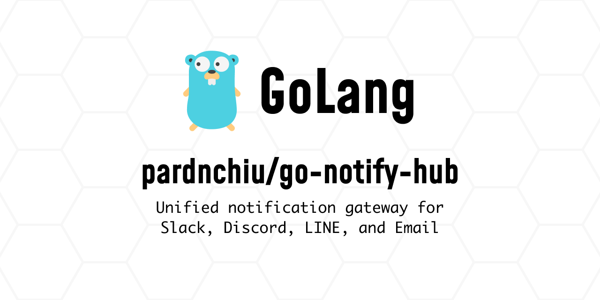

> [!NOTE]
> This README was generated by [Claude Code](https://github.com/pardnchiu/skill-readme-generate), get the ZH version from [here](./README.zh.md).

# go-notify-hub

> Multi-platform notification API service integrating Discord Webhook, Slack Webhook, LINE Bot, and Email with a unified RESTful API for managing all notification channels.

## Table of Contents

- [Features](#features)
- [Architecture](#architecture)
- [Installation](#installation)
- [Configuration](#configuration)
- [Usage](#usage)
- [API Reference](#api-reference)
- [License](#license)
- [Author](#author)

## Features

- **Multi-platform Integration**: Support for Discord Webhook, Slack Webhook, LINE Bot, and Email
- **Unified API**: Manage all notification channels through RESTful API
- **Channel Management**: Dynamically add, remove, and list registered channels
- **LINE Bot Interaction**: Automatic handling of follow/unfollow events and batch broadcasting
- **Email Delivery**: Single and bulk email sending with TLS/STARTTLS support
- **Rich Message Formatting**: Support for embeds, attachments, fields, images, and more
- **Concurrency Safe**: Uses RWMutex to protect shared data structures

## Architecture

```
cmd/
└── api/
    └── main.go              # Application entry point
internal/
├── channel/
│   ├── discord.go           # Discord Webhook send logic
│   └── slack.go             # Slack Webhook send logic
├── database/
│   ├── sqlite.go            # SQLite connection management
│   ├── insertUser.go        # Insert user
│   ├── deleteUser.go        # Delete user
│   └── selectUserLinebot.go # Query LINE Bot users
├── discord/
│   ├── discord.go           # Discord Handler initialization
│   ├── send.go              # Send message
│   ├── add.go               # Add channel
│   └── delete.go            # Delete channel
├── email/
│   ├── email.go             # Email client and SMTP sending
│   ├── send.go              # Single email sending
│   └── bulk.go              # Bulk email sending
├── linebot/
│   ├── webhook.go           # LINE Bot Webhook handler
│   ├── send.go              # Batch broadcast
│   └── handleMessage.go     # Message handling
├── slack/
│   ├── slack.go             # Slack Handler initialization
│   ├── send.go              # Send message
│   ├── add.go               # Add channel
│   └── delete.go            # Delete channel
└── utils/
    └── utils.go             # Utility functions
```

## Installation

### Prerequisites

- Go 1.20 or higher

### Download and Build

```bash
git clone https://github.com/pardnchiu/go-notify-hub.git
cd go-notify-hub
go mod download
go build -o go-notify-hub ./cmd/api
```

## Configuration

Create a `.env` file with the following environment variables:

```env
# Database path (optional, defaults to ~/.go-notify-hub/database.db)
DB_PATH=/path/to/database.db

# LINE Bot (optional)
LINEBOT_SECRET=your_line_channel_secret
LINEBOT_TOKEN=your_line_channel_access_token

# Email SMTP (required if using Email feature)
MAIL_SERVICE=smtp.example.com
MAIL_SERVICE_PORT=587
MAIL_SERVICE_USER=user@example.com
MAIL_SERVICE_PASSWORD=your_password
```

## Usage

### Start the Server

```bash
go run cmd/api/main.go
```

The server starts on `:8080`.

### Docker

```bash
docker-compose up -d
```

### Discord Webhook

```bash
# Add channel
curl -X POST http://localhost:8080/discord/add \
  -H "Content-Type: application/json" \
  -d '{
    "datas": [
      {"name": "alerts", "webhook": "https://discord.com/api/webhooks/..."}
    ]
  }'

# Send message
curl -X POST http://localhost:8080/discord/alerts \
  -H "Content-Type: application/json" \
  -d '{
    "title": "System Alert",
    "description": "Server is up and running",
    "color": "#00FF00"
  }'

# List channels
curl http://localhost:8080/discord/list

# Delete channel
curl -X DELETE http://localhost:8080/discord/alerts
```

### Slack Webhook

```bash
# Add channel
curl -X POST http://localhost:8080/slack/add \
  -H "Content-Type: application/json" \
  -d '{
    "datas": [
      {"name": "general", "webhook": "https://hooks.slack.com/services/..."}
    ]
  }'

# Send message
curl -X POST http://localhost:8080/slack/general \
  -H "Content-Type: application/json" \
  -d '{
    "text": "System Alert",
    "title": "Server Status",
    "description": "All services are running normally",
    "color": "good"
  }'
```

### LINE Bot Broadcast

```bash
# Broadcast to all followers
curl -X POST http://localhost:8080/linebot/send/all \
  -H "Content-Type: application/json" \
  -d '{
    "text": "System announcement",
    "image": "https://example.com/image.png"
  }'
```

### Email Sending

```bash
# Single email
curl -X POST http://localhost:8080/email/send \
  -H "Content-Type: application/json" \
  -d '{
    "to": "recipient@example.com",
    "subject": "Test Email",
    "body": "This is a test email",
    "is_html": false
  }'

# Bulk email
curl -X POST http://localhost:8080/email/send/bulk \
  -H "Content-Type: application/json" \
  -d '{
    "to": ["user1@example.com", "user2@example.com"],
    "subject": "System Announcement",
    "body": "<h1>Announcement Content</h1>",
    "is_html": true,
    "min_delay": 1
  }'
```

## API Reference

### Discord

| Method | Path | Description |
|--------|------|-------------|
| GET | `/discord/list` | List all registered channels |
| POST | `/discord/add` | Add channel |
| POST | `/discord/:channelName` | Send message to specified channel |
| DELETE | `/discord/:channelName` | Delete channel |

#### Discord Message Format

```json
{
  "title": "Title (required)",
  "description": "Content (required)",
  "url": "https://example.com",
  "color": "#FF5733",
  "timestamp": "2025-01-01T00:00:00Z",
  "image": "https://example.com/image.png",
  "thumbnail": "https://example.com/thumb.png",
  "fields": [
    {"name": "Field Name", "value": "Field Value", "inline": true}
  ],
  "footer": {"text": "Footer text", "icon_url": "https://example.com/icon.png"},
  "author": {"name": "Author Name", "url": "https://example.com", "icon_url": "https://example.com/author.png"},
  "username": "Custom Bot Name",
  "avatar_url": "https://example.com/avatar.png"
}
```

### Slack

| Method | Path | Description |
|--------|------|-------------|
| GET | `/slack/list` | List all registered channels |
| POST | `/slack/add` | Add channel |
| POST | `/slack/:channelName` | Send message to specified channel |
| DELETE | `/slack/:channelName` | Delete channel |

#### Slack Message Format

```json
{
  "text": "Message text (required)",
  "title": "Attachment title",
  "title_link": "https://example.com",
  "description": "Attachment content",
  "pretext": "Text above attachment",
  "color": "#FF5733",
  "timestamp": 1704067200,
  "image": "https://example.com/image.png",
  "thumbnail": "https://example.com/thumb.png",
  "fields": [
    {"title": "Field Name", "value": "Field Value", "short": true}
  ],
  "footer": {"text": "Footer text", "icon_url": "https://example.com/icon.png"},
  "username": "Custom Bot Name",
  "icon_emoji": ":rocket:",
  "channel": "#channel",
  "thread_ts": "1234567890.123456"
}
```

### LINE Bot

| Method | Path | Description |
|--------|------|-------------|
| POST | `/linebot/webhook` | LINE Webhook endpoint |
| POST | `/linebot/send/all` | Broadcast to all followers |

#### LINE Bot Message Format

```json
{
  "text": "Message content",
  "image": "https://example.com/image.png",
  "image_preview": "https://example.com/preview.png"
}
```

### Email

| Method | Path | Description |
|--------|------|-------------|
| POST | `/email/send` | Send single email |
| POST | `/email/send/bulk` | Send bulk emails |

#### Email Send Format

```json
{
  "to": "recipient@example.com",
  "subject": "Email subject (required)",
  "body": "Email body (required)",
  "alt_body": "Plain text alternative",
  "from": "sender@example.com",
  "cc": "cc@example.com",
  "bcc": "bcc@example.com",
  "priority": "high",
  "is_html": true
}
```

#### Email Bulk Send Format

```json
{
  "to": ["user1@example.com", "user2@example.com"],
  "subject": "Email subject (required)",
  "body": "Email body (required)",
  "from": "sender@example.com",
  "is_html": false,
  "min_delay": 1,
  "stop_on_error": false
}
```

**Recipient format support**:

- Single address: `"user@example.com"`
- Multiple addresses: `["user1@example.com", "user2@example.com"]`
- With name: `"Name:user@example.com"` or `{"user@example.com": "Name"}`

## License

MIT License

## Author


<h4 style="padding-top: 0">邱敬幃 Pardn Chiu</h4>

<a href="mailto:dev@pardn.io" target="_blank">

</a> <a href="https://linkedin.com/in/pardnchiu" target="_blank">

</a>

***

©️ 2026 [邱敬幃 Pardn Chiu](https://linkedin.com/in/pardnchiu)
