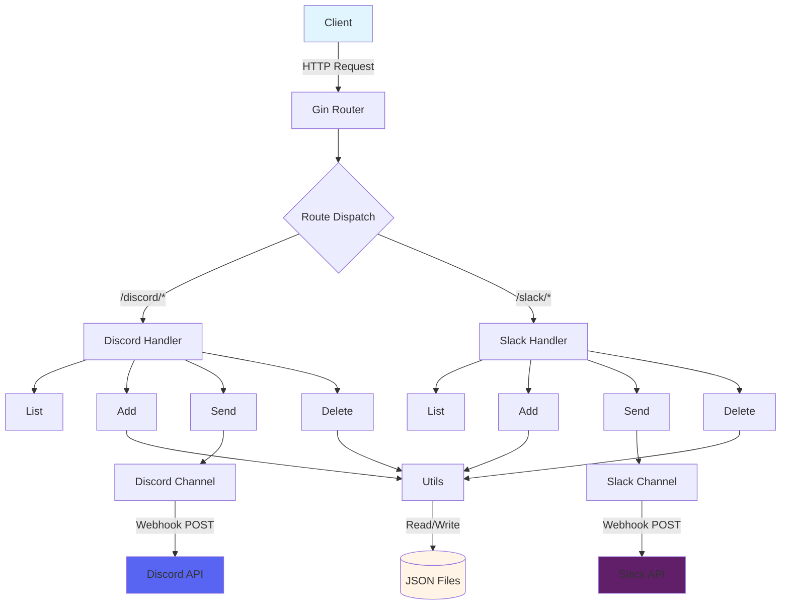

# goNotify

> [!NOTE]
> This README was generated by Claude Code, get the ZH version from [here](./README.zh.md).

[](https://pkg.go.dev/github.com/pardnchiu/goNotify)
[](https://goreportcard.com/report/github.com/pardnchiu/goNotify)
[](LICENSE)
[](https://github.com/pardnchiu/goNotify/releases)

> Lightweight webhook notification API service supporting Discord and Slack multi-channel management and message delivery.

## Features

- **Multi-platform Support**: Integrates Discord and Slack webhook APIs
- **Dynamic Channel Management**: Add, delete, and query channel configurations at runtime
- **Rich Message Formatting**: Supports embeds, attachments, fields, images, footers, and more
- **RESTful API**: Clean HTTP endpoint design for easy integration
- **Persistent Configuration**: Automatically saves channel configurations as JSON files
- **Concurrency Safe**: Uses RWMutex to protect shared data structures

## Installation

### Prerequisites

- Go 1.25.1 or higher
- Git

### Download and Install

```bash
# Clone the repository
git clone https://github.com/pardnchiu/goNotify.git
cd goNotify

# Download dependencies
go mod download

# Build and run
go run cmd/api/main.go
```

The service will start on port `:8080`.

## Usage

### Discord Operations

#### 1. Add Discord Channel

```bash
curl -X POST http://localhost:8080/discord/add \
  -H "Content-Type: application/json" \
  -d '{
    "datas": [
      {
        "name": "alerts",
        "webhook": "https://discord.com/api/webhooks/123456789/abcdefg"
      }
    ]
  }'
```

#### 2. Send Discord Message

```bash
curl -X POST http://localhost:8080/discord/alerts \
  -H "Content-Type: application/json" \
  -d '{
    "title": "System Alert",
    "description": "Server CPU usage is high",
    "color": "#FF5733",
    "fields": [
      {
        "name": "Server",
        "value": "web-01",
        "inline": true
      },
      {
        "name": "CPU Usage",
        "value": "95%",
        "inline": true
      }
    ],
    "footer": {
      "text": "Monitoring System",
      "icon_url": "https://example.com/icon.png"
    }
  }'
```

#### 3. List Discord Channels

```bash
curl http://localhost:8080/discord/list
```

Response example:
```json
{
  "alerts": "https://discord.com/api/webhooks/123456789/abcdefg",
  "notifications": "https://discord.com/api/webhooks/987654321/hijklmn"
}
```

#### 4. Delete Discord Channel

```bash
curl -X DELETE http://localhost:8080/discord/alerts
```

### Slack Operations

#### 1. Add Slack Channel

```bash
curl -X POST http://localhost:8080/slack/add \
  -H "Content-Type: application/json" \
  -d '{
    "datas": [
      {
        "name": "deployments",
        "webhook": "https://hooks.slack.com/services/T00000000/B00000000/XXXXXXXXXXXXXXXXXXXX"
      }
    ]
  }'
```

#### 2. Send Slack Message

```bash
curl -X POST http://localhost:8080/slack/deployments \
  -H "Content-Type: application/json" \
  -d '{
    "text": "Deployment completed",
    "title": "Production Deployment",
    "description": "Version v1.2.3 successfully deployed to production",
    "color": "good",
    "fields": [
      {
        "title": "Environment",
        "value": "Production",
        "short": true
      },
      {
        "title": "Version",
        "value": "v1.2.3",
        "short": true
      }
    ],
    "footer": {
      "text": "CI/CD Pipeline"
    }
  }'
```

#### 3. List Slack Channels

```bash
curl http://localhost:8080/slack/list
```

#### 4. Delete Slack Channel

```bash
curl -X DELETE http://localhost:8080/slack/deployments
```

## API Reference

### Discord API

| Endpoint | Method | Description |
|----------|--------|-------------|
| `/discord/list` | GET | Get all Discord channel configurations |
| `/discord/:channelName` | POST | Send message to specified Discord channel |
| `/discord/add` | POST | Add one or more Discord channels |
| `/discord/:channelName` | DELETE | Delete specified Discord channel |

#### Discord Message Fields

| Field | Type | Required | Description |
|-------|------|----------|-------------|
| `title` | string | Yes | Embed title |
| `description` | string | Yes | Embed content description |
| `url` | string | No | Title hyperlink |
| `color` | string | No | Sidebar color (hex format, e.g. `#FF5733`) |
| `timestamp` | string | No | ISO8601 timestamp |
| `image` | string | No | Large image URL |
| `thumbnail` | string | No | Thumbnail URL |
| `fields` | array | No | Field array (`name`, `value`, `inline`) |
| `footer` | object | No | Footer object (`text`, `icon_url`) |
| `author` | object | No | Author object (`name`, `url`, `icon_url`) |
| `username` | string | No | Bot display name |
| `avatar_url` | string | No | Bot avatar URL |

### Slack API

| Endpoint | Method | Description |
|----------|--------|-------------|
| `/slack/list` | GET | Get all Slack channel configurations |
| `/slack/:channelName` | POST | Send message to specified Slack channel |
| `/slack/add` | POST | Add one or more Slack channels |
| `/slack/:channelName` | DELETE | Delete specified Slack channel |

#### Slack Message Fields

| Field | Type | Required | Description |
|-------|------|----------|-------------|
| `text` | string | Yes | Message text (notification and fallback) |
| `title` | string | No | Attachment title |
| `title_link` | string | No | Title hyperlink |
| `description` | string | No | Attachment content |
| `pretext` | string | No | Text above attachment |
| `color` | string | No | Sidebar color (`good`/`warning`/`danger` or hex) |
| `timestamp` | int64 | No | Unix timestamp |
| `image` | string | No | Large image URL |
| `thumbnail` | string | No | Thumbnail URL (right side) |
| `fields` | array | No | Field array (`title`, `value`, `short`) |
| `footer` | object | No | Footer object (`text`, `icon_url`) |
| `username` | string | No | Bot display name |
| `icon_emoji` | string | No | Bot icon emoji (e.g. `:rocket:`) |
| `icon_url` | string | No | Bot avatar URL |
| `channel` | string | No | Target channel (e.g. `#channel` or `@user`) |
| `thread_ts` | string | No | Thread timestamp (for replies) |

## Project Structure

```
goNotify/
├── cmd/
│   └── api/
│       └── main.go              # Application entry point
├── internal/
│   ├── channel/
│   │   ├── discord.go           # Discord webhook client
│   │   └── slack.go             # Slack webhook client
│   ├── handler/
│   │   ├── discord.go           # Discord handler initialization
│   │   ├── discordAdd.go        # Add Discord channel
│   │   ├── discordSend.go       # Send Discord message
│   │   ├── discordDelete.go     # Delete Discord channel
│   │   ├── slack.go             # Slack handler initialization
│   │   ├── slackAdd.go          # Add Slack channel
│   │   ├── slackSend.go         # Send Slack message
│   │   └── slackDelete.go       # Delete Slack channel
│   └── utils/
│       └── utils.go             # Shared utilities (file I/O, JSON handling)
├── json/
│   ├── discord_channel.json     # Discord channel config (auto-generated)
│   └── slack_channel.json       # Slack channel config (auto-generated)
├── go.mod                       # Go module definition
└── go.sum                       # Dependency version lock
```

## Architecture



## Use Cases

### 1. CI/CD Pipeline Notifications

Send status updates during deployment workflows:

```bash
# Deployment started
curl -X POST http://localhost:8080/slack/cicd \
  -d '{"text": "🚀 Starting production deployment", "color": "warning"}'

# Deployment succeeded
curl -X POST http://localhost:8080/slack/cicd \
  -d '{"text": "✅ Deployment completed", "color": "good"}'
```

### 2. System Monitoring Alerts

Send alerts when server metrics are abnormal:

```bash
curl -X POST http://localhost:8080/discord/monitoring \
  -d '{
    "title": "🔴 CPU Alert",
    "description": "Server load is too high",
    "color": "#FF0000",
    "fields": [
      {"name": "Host", "value": "web-01", "inline": true},
      {"name": "CPU", "value": "98%", "inline": true}
    ]
  }'
```

### 3. Application Error Notifications

Capture and send application errors:

```go
func notifyError(err error) {
    payload := map[string]interface{}{
        "title":       "Application Error",
        "description": err.Error(),
        "color":       "#FF5733",
    }
    
    // Send to Discord
    http.Post("http://localhost:8080/discord/errors", 
        "application/json", 
        bytes.NewBuffer(jsonPayload))
}
```

## License

MIT License

## Author


<h4 style="padding-top: 0">邱敬幃 Pardn Chiu</h4>

<a href="mailto:dev@pardn.io" target="_blank">

</a> <a href="https://linkedin.com/in/pardnchiu" target="_blank">

</a>

## Stars

[](https://www.star-history.com/#pardnchiu/goNotify&Date)

***

©️ 2026 [邱敬幃 Pardn Chiu](https://linkedin.com/in/pardnchiu)
