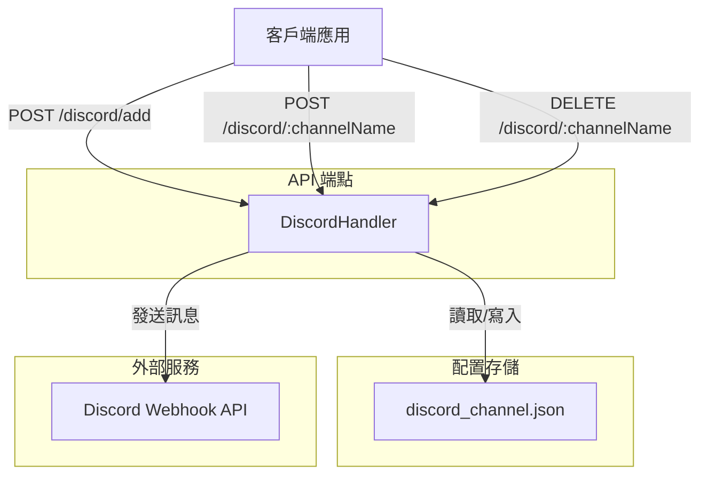

# goNotify

> [!NOTE]
> 此 README 由 Claude Code 生成，英文版請參閱 [這裡](./README.md)。

[](https://pkg.go.dev/goNotify)
[](LICENSE)
[](https://goreportcard.com/report/github.com/pardnchiu/bot)

> 一個輕量級的 Go 通知 API 服務，提供 Discord Webhook 整合，支援動態頻道註冊、訊息發送及頻道管理功能。

## 功能特點

- **RESTful API 設計**：提供簡潔的 HTTP API 介面，易於整合至任何應用程式
- **Discord Webhook 整合**：支援完整的 Discord Embed 訊息格式，包含圖片、欄位、頁尾等元素
- **動態頻道管理**：透過 API 即時新增或刪除 Discord 頻道配置，無需重啟服務
- **JSON 配置存儲**：使用檔案系統持久化頻道配置，資料管理簡單直觀
- **並發安全設計**：使用 RWMutex 保護共享資源，確保多執行緒環境下的資料一致性
- **輸入驗證機制**：包含頻道名稱與 Webhook URL 格式驗證，提升系統安全性

## 架構流程



## 安裝

### 前置需求

- Go 1.25.1 或更新版本
- 有效的 Discord Webhook URL

### 下載與編譯

```bash
# 複製專案
git clone https://github.com/pardnchiu/bot.git
cd bot

# 安裝依賴
go mod download

# 編譯專案
go build -o goNotify ./cmd/api

# 執行服務
./goNotify
```

服務將在 `http://localhost:8080` 啟動。

## 使用方法

### 1. 新增 Discord 頻道

在發送通知前，需先註冊 Discord Webhook URL：

```bash
curl -X POST http://localhost:8080/discord/add \
  -H "Content-Type: application/json" \
  -d '{
    "datas": [
      {
        "name": "alerts",
        "webhook": "https://discord.com/api/webhooks/1234567890/abcdefghijklmnopqrstuvwxyz"
      },
      {
        "name": "logs",
        "webhook": "https://discord.com/api/webhooks/0987654321/zyxwvutsrqponmlkjihgfedcba"
      }
    ]
  }'
```

**回應：**
```json
{
  "message": "channels added successfully"
}
```

### 2. 發送基本通知

```bash
curl -X POST http://localhost:8080/discord/alerts \
  -H "Content-Type: application/json" \
  -d '{
    "title": "系統警報",
    "description": "伺服器 CPU 使用率超過 90%"
  }'
```

### 3. 發送進階通知（包含完整 Embed 元素）

```bash
curl -X POST http://localhost:8080/discord/alerts \
  -H "Content-Type: application/json" \
  -d '{
    "title": "部署成功",
    "description": "應用程式版本 v2.1.0 已成功部署至生產環境",
    "url": "https://example.com/deployment/12345",
    "color": "#00ff00",
    "timestamp": "2026-01-13T21:00:00Z",
    "thumbnail": "https://example.com/logo.png",
    "fields": [
      {
        "name": "環境",
        "value": "Production",
        "inline": true
      },
      {
        "name": "版本",
        "value": "v2.1.0",
        "inline": true
      },
      {
        "name": "部署時間",
        "value": "3 分 25 秒",
        "inline": false
      }
    ],
    "footer": {
      "text": "CI/CD Pipeline",
      "icon_url": "https://example.com/ci-icon.png"
    },
    "author": {
      "name": "DevOps Bot",
      "url": "https://example.com/devops",
      "icon_url": "https://example.com/bot-avatar.png"
    },
    "username": "部署通知機器人",
    "avatar_url": "https://example.com/deploy-avatar.png"
  }'
```

### 4. 刪除 Discord 頻道

```bash
curl -X DELETE http://localhost:8080/discord/alerts
```

**回應：**
```json
{
  "message": "channel deleted successfully"
}
```

## API 規格

### POST `/discord/add`

新增一個或多個 Discord 頻道配置。

**請求體：**
```json
{
  "datas": [
    {
      "name": "string",      // 頻道名稱（僅允許 0-9、A-Z、a-z、@、_、-）
      "webhook": "string"    // Discord Webhook URL
    }
  ]
}
```

**回應碼：**
- `200 OK`：頻道新增成功
- `400 Bad Request`：無效的頻道名稱或 Webhook URL 格式
- `500 Internal Server Error`：伺服器錯誤

### POST `/discord/:channelName`

發送通知至指定的 Discord 頻道。

**路徑參數：**
- `channelName`：已註冊的頻道名稱

**請求體：**
```json
{
  "title": "string",              // 必填：標題
  "description": "string",        // 必填：內容描述
  "url": "string",                // 選填：標題連結
  "color": "#RRGGBB",             // 選填：顏色（Hex 格式）
  "timestamp": "ISO8601",         // 選填：時間戳記
  "image": "string",              // 選填：大圖 URL
  "thumbnail": "string",          // 選填：縮圖 URL
  "fields": [                     // 選填：自定義欄位
    {
      "name": "string",
      "value": "string",
      "inline": boolean
    }
  ],
  "footer": {                     // 選填：頁尾
    "text": "string",
    "icon_url": "string"
  },
  "author": {                     // 選填：作者資訊
    "name": "string",
    "url": "string",
    "icon_url": "string"
  },
  "username": "string",           // 選填：覆蓋機器人顯示名稱
  "avatar_url": "string"          // 選填：覆蓋機器人頭像
}
```

**回應碼：**
- `200 OK`：通知發送成功
- `400 Bad Request`：缺少必填欄位或頻道不存在
- `500 Internal Server Error`：Discord API 錯誤

### DELETE `/discord/:channelName`

刪除指定的 Discord 頻道配置。

**路徑參數：**
- `channelName`：要刪除的頻道名稱

**回應碼：**
- `200 OK`：頻道刪除成功
- `400 Bad Request`：無效的頻道名稱格式
- `500 Internal Server Error`：伺服器錯誤

## 應用場景

### 監控告警通知

整合至監控系統（如 Prometheus、Grafana），當指標超過閾值時自動發送告警至 Discord 頻道。

```go
package main

import (
    "bytes"
    "encoding/json"
    "net/http"
)

func sendAlert(metric string, value float64) error {
    payload := map[string]interface{}{
        "title":       "監控告警",
        "description": fmt.Sprintf("%s 當前值: %.2f", metric, value),
        "color":       "#ff0000",
        "fields": []map[string]interface{}{
            {
                "name":   "嚴重程度",
                "value":  "高",
                "inline": true,
            },
        },
    }
    
    data, _ := json.Marshal(payload)
    resp, err := http.Post(
        "http://localhost:8080/discord/alerts",
        "application/json",
        bytes.NewBuffer(data),
    )
    if err != nil {
        return err
    }
    defer resp.Body.Close()
    return nil
}
```

### CI/CD 流程通知

在持續整合/部署流程中發送建置與部署狀態通知。

```bash
#!/bin/bash
# 部署腳本範例

if ./deploy.sh; then
  curl -X POST http://localhost:8080/discord/deployments \
    -H "Content-Type: application/json" \
    -d "{
      \"title\": \"✅ 部署成功\",
      \"description\": \"版本 ${VERSION} 已部署至生產環境\",
      \"color\": \"#00ff00\"
    }"
else
  curl -X POST http://localhost:8080/discord/deployments \
    -H "Content-Type: application/json" \
    -d "{
      \"title\": \"❌ 部署失敗\",
      \"description\": \"版本 ${VERSION} 部署失敗，請檢查日誌\",
      \"color\": \"#ff0000\"
    }"
fi
```

### 應用程式日誌聚合

將應用程式重要事件即時推送至 Discord 進行團隊協作。

```go
package logger

import (
    "bytes"
    "encoding/json"
    "net/http"
)

type DiscordLogger struct {
    channelName string
    apiURL      string
}

func (l *DiscordLogger) Error(message string, err error) {
    payload := map[string]interface{}{
        "title":       "應用程式錯誤",
        "description": message,
        "color":       "#ff0000",
        "fields": []map[string]interface{}{
            {
                "name":  "錯誤訊息",
                "value": err.Error(),
            },
        },
    }
    
    data, _ := json.Marshal(payload)
    http.Post(
        l.apiURL+"/discord/"+l.channelName,
        "application/json",
        bytes.NewBuffer(data),
    )
}
```

## 專案結構

```
bot/
├── cmd/
│   └── api/
│       └── main.go              # 應用程式入口點
├── internal/
│   ├── handler/
│   │   └── discord.go           # Discord API 處理器
│   ├── channel/
│   │   └── discord.go           # Discord Webhook 客戶端
│   └── bot/
│       └── line.go              # LINE Bot 整合（待開發）
├── json/
│   └── discord_channel.json     # 頻道配置檔案
├── go.mod                       # Go 模組定義
└── go.sum                       # 依賴版本鎖定
```

## 配置說明

頻道配置檔案 `json/discord_channel.json` 範例：

```json
{
  "alerts": "https://discord.com/api/webhooks/1234567890/abcdefg...",
  "logs": "https://discord.com/api/webhooks/0987654321/zyxwvut...",
  "deployments": "https://discord.com/api/webhooks/1122334455/hijklmn..."
}
```

此檔案會在執行時自動建立，也可透過 API 動態管理。

## 依賴套件

| 套件 | 版本 | 用途 |
|------|------|------|
| [gin-gonic/gin](https://github.com/gin-gonic/gin) | v1.11.0 | HTTP Web 框架 |
| encoding/json | 標準庫 | JSON 序列化/反序列化 |
| net/http | 標準庫 | HTTP 客戶端 |
| sync | 標準庫 | 並發控制 |

## 安全性考量

1. **輸入驗證**：所有頻道名稱與 Webhook URL 都經過正則表達式驗證
2. **並發安全**：使用 `sync.RWMutex` 保護共享的頻道配置映射
3. **錯誤處理**：完整的錯誤處理與日誌記錄，避免敏感資訊洩漏
4. **檔案權限**：JSON 配置檔案使用 `0644` 權限（擁有者可讀寫，其他人唯讀）

## 開發計劃

- [ ] 新增 LINE Notify 整合
- [ ] 支援 Slack Webhook
- [ ] 實作訊息佇列機制
- [ ] 新增 Prometheus metrics 端點
- [ ] 支援訊息範本功能
- [ ] 實作訊息發送歷史記錄

## 授權

MIT License

## Author


<h4 style="padding-top: 0">邱敬幃 Pardn Chiu</h4>

<a href="mailto:dev@pardn.io" target="_blank">

</a> <a href="https://linkedin.com/in/pardnchiu" target="_blank">

</a>

## Stars

[](https://star-history.com/#pardnchiu/bot&Date)

***

©️ 2026 [邱敬幃 Pardn Chiu](https://linkedin.com/in/pardnchiu)
