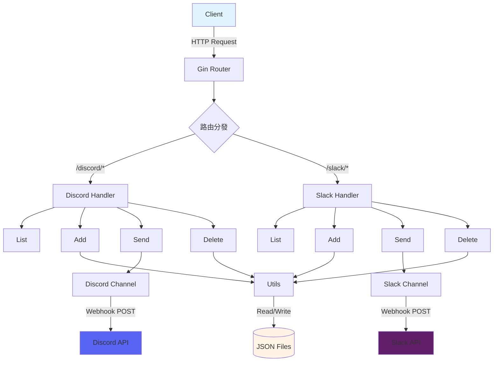

# goNotify

> [!NOTE]
> 此 README 由 Claude Code 生成，英文版請參閱 [這裡](./README.md)。

[](https://pkg.go.dev/github.com/pardnchiu/goNotify)
[](https://goreportcard.com/report/github.com/pardnchiu/goNotify)
[](LICENSE)
[](https://github.com/pardnchiu/goNotify/releases)

> 輕量級 Webhook 通知 API 服務，支援 Discord 和 Slack 多頻道管理與訊息推送。

## 功能特點

- **多平台支援**：整合 Discord 和 Slack webhook API
- **動態頻道管理**：支援執行期間新增、刪除、查詢頻道配置
- **豐富訊息格式**：支援 Embeds、附件、欄位、圖片、Footer 等進階格式
- **RESTful API**：簡潔的 HTTP 端點設計，易於整合
- **持久化配置**：自動將頻道配置儲存為 JSON 檔案
- **併發安全**：使用 RWMutex 保護共享資料結構

## 安裝

### 前置需求

- Go 1.25.1 或更高版本
- Git

### 下載與安裝

```bash
# 克隆專案
git clone https://github.com/pardnchiu/goNotify.git
cd goNotify

# 下載依賴
go mod download

# 編譯執行
go run cmd/api/main.go
```

服務將在 `:8080` 埠啟動。

## 使用方法

### Discord 操作

#### 1. 新增 Discord 頻道

```bash
curl -X POST http://localhost:8080/discord/add \
  -H "Content-Type: application/json" \
  -d '{
    "datas": [
      {
        "name": "alerts",
        "webhook": "https://discord.com/api/webhooks/123456789/abcdefg"
      }
    ]
  }'
```

#### 2. 發送 Discord 訊息

```bash
curl -X POST http://localhost:8080/discord/alerts \
  -H "Content-Type: application/json" \
  -d '{
    "title": "系統告警",
    "description": "伺服器 CPU 使用率過高",
    "color": "#FF5733",
    "fields": [
      {
        "name": "伺服器",
        "value": "web-01",
        "inline": true
      },
      {
        "name": "CPU 使用率",
        "value": "95%",
        "inline": true
      }
    ],
    "footer": {
      "text": "監控系統",
      "icon_url": "https://example.com/icon.png"
    }
  }'
```

#### 3. 查詢 Discord 頻道列表

```bash
curl http://localhost:8080/discord/list
```

回應範例：
```json
{
  "alerts": "https://discord.com/api/webhooks/123456789/abcdefg",
  "notifications": "https://discord.com/api/webhooks/987654321/hijklmn"
}
```

#### 4. 刪除 Discord 頻道

```bash
curl -X DELETE http://localhost:8080/discord/alerts
```

### Slack 操作

#### 1. 新增 Slack 頻道

```bash
curl -X POST http://localhost:8080/slack/add \
  -H "Content-Type: application/json" \
  -d '{
    "datas": [
      {
        "name": "deployments",
        "webhook": "https://hooks.slack.com/services/T00000000/B00000000/XXXXXXXXXXXXXXXXXXXX"
      }
    ]
  }'
```

#### 2. 發送 Slack 訊息

```bash
curl -X POST http://localhost:8080/slack/deployments \
  -H "Content-Type: application/json" \
  -d '{
    "text": "部署完成通知",
    "title": "Production 部署",
    "description": "版本 v1.2.3 已成功部署至生產環境",
    "color": "good",
    "fields": [
      {
        "title": "環境",
        "value": "Production",
        "short": true
      },
      {
        "title": "版本",
        "value": "v1.2.3",
        "short": true
      }
    ],
    "footer": {
      "text": "CI/CD Pipeline"
    }
  }'
```

#### 3. 查詢 Slack 頻道列表

```bash
curl http://localhost:8080/slack/list
```

#### 4. 刪除 Slack 頻道

```bash
curl -X DELETE http://localhost:8080/slack/deployments
```

## API 參考

### Discord API

| 端點 | 方法 | 說明 |
|------|------|------|
| `/discord/list` | GET | 取得所有 Discord 頻道配置 |
| `/discord/:channelName` | POST | 發送訊息至指定 Discord 頻道 |
| `/discord/add` | POST | 新增一個或多個 Discord 頻道 |
| `/discord/:channelName` | DELETE | 刪除指定 Discord 頻道 |

#### Discord 訊息欄位

| 欄位 | 類型 | 必填 | 說明 |
|------|------|------|------|
| `title` | string | 是 | Embed 標題 |
| `description` | string | 是 | Embed 內容描述 |
| `url` | string | 否 | 標題超連結 |
| `color` | string | 否 | 側邊顏色（十六進位，如 `#FF5733`） |
| `timestamp` | string | 否 | ISO8601 時間戳記 |
| `image` | string | 否 | 大圖片 URL |
| `thumbnail` | string | 否 | 縮圖 URL |
| `fields` | array | 否 | 欄位陣列（`name`、`value`、`inline`） |
| `footer` | object | 否 | Footer 物件（`text`、`icon_url`） |
| `author` | object | 否 | 作者物件（`name`、`url`、`icon_url`） |
| `username` | string | 否 | Bot 顯示名稱 |
| `avatar_url` | string | 否 | Bot 頭像 URL |

### Slack API

| 端點 | 方法 | 說明 |
|------|------|------|
| `/slack/list` | GET | 取得所有 Slack 頻道配置 |
| `/slack/:channelName` | POST | 發送訊息至指定 Slack 頻道 |
| `/slack/add` | POST | 新增一個或多個 Slack 頻道 |
| `/slack/:channelName` | DELETE | 刪除指定 Slack 頻道 |

#### Slack 訊息欄位

| 欄位 | 類型 | 必填 | 說明 |
|------|------|------|------|
| `text` | string | 是 | 訊息文字（通知與 fallback） |
| `title` | string | 否 | Attachment 標題 |
| `title_link` | string | 否 | 標題超連結 |
| `description` | string | 否 | Attachment 內容 |
| `pretext` | string | 否 | Attachment 上方文字 |
| `color` | string | 否 | 側邊顏色（`good`/`warning`/`danger` 或十六進位） |
| `timestamp` | int64 | 否 | Unix 時間戳記 |
| `image` | string | 否 | 大圖片 URL |
| `thumbnail` | string | 否 | 縮圖 URL（右側） |
| `fields` | array | 否 | 欄位陣列（`title`、`value`、`short`） |
| `footer` | object | 否 | Footer 物件（`text`、`icon_url`） |
| `username` | string | 否 | Bot 顯示名稱 |
| `icon_emoji` | string | 否 | Bot 圖示 emoji（如 `:rocket:`） |
| `icon_url` | string | 否 | Bot 頭像 URL |
| `channel` | string | 否 | 目標頻道（如 `#channel` 或 `@user`） |
| `thread_ts` | string | 否 | 執行緒時間戳記（用於回覆） |

## 專案結構

```
goNotify/
├── cmd/
│   └── api/
│       └── main.go              # 應用程式入口點
├── internal/
│   ├── channel/
│   │   ├── discord.go           # Discord webhook 客戶端
│   │   └── slack.go             # Slack webhook 客戶端
│   ├── handler/
│   │   ├── discord.go           # Discord handler 初始化
│   │   ├── discordAdd.go        # 新增 Discord 頻道
│   │   ├── discordSend.go       # 發送 Discord 訊息
│   │   ├── discordDelete.go     # 刪除 Discord 頻道
│   │   ├── slack.go             # Slack handler 初始化
│   │   ├── slackAdd.go          # 新增 Slack 頻道
│   │   ├── slackSend.go         # 發送 Slack 訊息
│   │   └── slackDelete.go       # 刪除 Slack 頻道
│   └── utils/
│       └── utils.go             # 共用工具函式（檔案 I/O、JSON 處理）
├── json/
│   ├── discord_channel.json     # Discord 頻道配置（自動生成）
│   └── slack_channel.json       # Slack 頻道配置（自動生成）
├── go.mod                       # Go 模組定義
└── go.sum                       # 依賴版本鎖定
```

## 設計架構



## 使用場景

### 1. CI/CD 管道通知

在部署流程中發送狀態更新：

```bash
# 部署開始
curl -X POST http://localhost:8080/slack/cicd \
  -d '{"text": "🚀 開始部署至 Production", "color": "warning"}'

# 部署成功
curl -X POST http://localhost:8080/slack/cicd \
  -d '{"text": "✅ 部署完成", "color": "good"}'
```

### 2. 系統監控告警

伺服器指標異常時發送告警：

```bash
curl -X POST http://localhost:8080/discord/monitoring \
  -d '{
    "title": "🔴 CPU 告警",
    "description": "伺服器負載過高",
    "color": "#FF0000",
    "fields": [
      {"name": "主機", "value": "web-01", "inline": true},
      {"name": "CPU", "value": "98%", "inline": true}
    ]
  }'
```

### 3. 應用程式錯誤通知

捕獲並發送應用程式錯誤：

```go
func notifyError(err error) {
    payload := map[string]interface{}{
        "title":       "Application Error",
        "description": err.Error(),
        "color":       "#FF5733",
    }
    
    // 發送至 Discord
    http.Post("http://localhost:8080/discord/errors", 
        "application/json", 
        bytes.NewBuffer(jsonPayload))
}
```

## 授權

MIT License

## Author


<h4 style="padding-top: 0">邱敬幃 Pardn Chiu</h4>

<a href="mailto:dev@pardn.io" target="_blank">

</a> <a href="https://linkedin.com/in/pardnchiu" target="_blank">

</a>

## Stars

[](https://www.star-history.com/#pardnchiu/goNotify&Date)

***

©️ 2026 [邱敬幃 Pardn Chiu](https://linkedin.com/in/pardnchiu)
